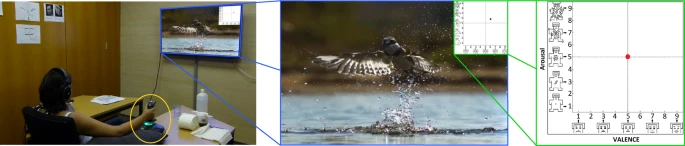

# Continuous Annotation Signals of Emotion (CASE)

"From a computational viewpoint, emotions continue to be intriguingly hard to understand. In research, a direct and real-time inspection in realistic settings is not possible. Discrete, indirect, post-hoc recordings are therefore the norm. As a result, proper emotion assessment remains a problematic issue. The Continuously Annotated Signals of Emotion (CASE) dataset provides a solution as it focusses on real-time continuous annotation of emotions, as experienced by the participants, while watching various videos. For this purpose, a novel, intuitive joystick-based annotation interface was developed, that allowed for simultaneous reporting of valence and arousal, that are instead often annotated independently. In parallel, eight high quality, synchronized physiological recordings (1000 Hz, 16-bit ADC) were obtained from ECG, BVP, EMG (3x), GSR (or EDA), respiration and skin temperature sensors. The dataset consists of the physiological and annotation data from 30 participants, 15 male and 15 female, who watched several validated video-stimuli. The validity of the emotion induction, as exemplified by the annotation and physiological data, is also presented."

## Key points
- Raw biosignals and continuous valence-arousal annotations
- Both the biosignals and the continuous annotations require preprocessing and feature extraction
- Lab environment

## Difficulty score
The diffculty score for this dataset is 1.0. This means that a maximum of 1.0 bonus points can be achieved depending on the complexity of your preprocessing and feature extraction. We assigned the maximum difficulty score because considerable preprocessing and feature extraction is required when using this dataset.

For a maximum score: extract features from two biosignals and use the continuous joystick data to segment the data streams properly. In addition, use proper preprocessing. 

## Access
Download the dataset at [Figshare](https://springernature.figshare.com/collections/A_dataset_of_continuous_affect_annotations_and_physiological_signals_for_emotion_analysis/4260668) 

## Paper
> Sharma, K., Castellini, C., van den Broek, E. L., Albu-Schaeffer, A., & Schwenker, F. (2019). A dataset of continuous affect annotations and physiological signals for emotion analysis. *Scientific data*, 6(1), 196.

https://www.nature.com/articles/s41597-019-0209-0#Sec23