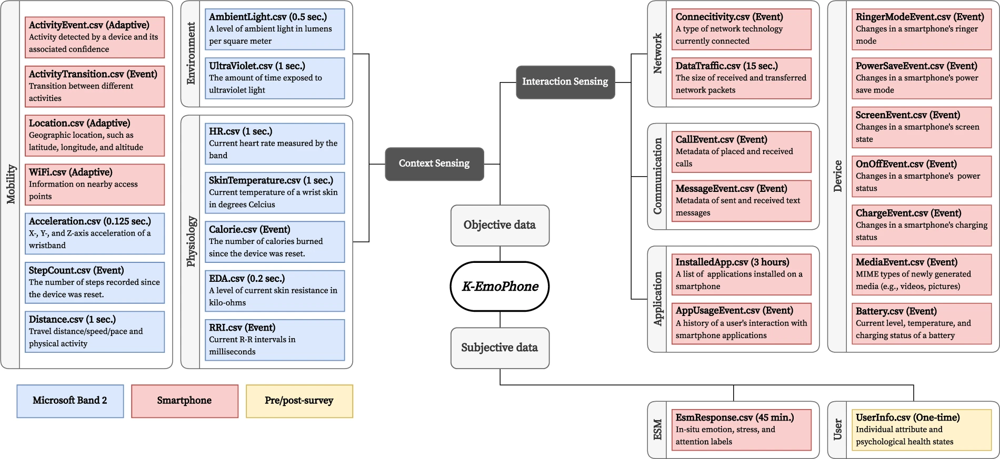

# K-EmoPhone

"With the popularization of low-cost mobile and wearable sensors, several studies have used them to track and analyze mental well-being, productivity, and behavioral patterns. However, there is still a lack of open datasets collected in real-world contexts with affective and cognitive state labels such as emotion, stress, and attention; the lack of such datasets limits research advances in affective computing and human-computer interaction. This study presents K-EmoPhone, a real-world multimodal dataset collected from 77 students over seven days. This dataset contains (1) continuous probing of peripheral physiological signals and mobility data measured by commercial off-the-shelf devices, (2) context and interaction data collected from individuals’ smartphones, and (3) 5,582 self-reported affect states, including emotions, stress, attention, and task disturbance, acquired by the experience sampling method. We anticipate the dataset will contribute to advancements in affective computing, emotion intelligence technologies, and attention management based on mobile and wearable sensor data."

## Key points
- 77 participants
- Large variety of signals/data streams
- Can be used to answer many research questions
- Sensitive data: We needed to ask permission to use this dataset. You are handling privacy sensitive data, so be aware.

## Difficulty score
The diffculty score for this dataset is 1.0. This means that a maximum of 1.0 bonus points can be achieved depending on the complexity of your preprocessing and feature extraction. We assigned the maximum difficulty score as there are many variables in the dataset that you can use to answer your research question. Be creative and come up with new and unexplored combinations! 

For a maximum score: Extract features and perform preprocessing on at least two signals from the Microsoft Band 2 and combine at least 2 smartphone data streams. For example, combining data traffic and app usage events to get a measure for social media activity. Processing and feature extraction should not be trivial.

## Access
Send me an email if you decide to use this dataset.

## Paper
> Kang, S., Choi, W., Park, C. Y., Cha, N., Kim, A., Khandoker, A. H., ... & Lee, U. (2023). K-emophone: A mobile and wearable dataset with in-situ emotion, stress, and attention labels. *Scientific data*, 10(1), 351.

https://www.nature.com/articles/s41597-023-02248-2