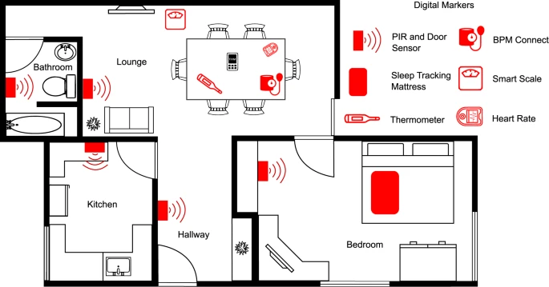

# TIHM: An open dataset for remote healthcare monitoring in dementia

"Dementia is a progressive condition that affects cognitive and functional abilities. There is a need for reliable and continuous health monitoring of People Living with Dementia (PLWD) to improve their quality of life and support their independent living. Healthcare services often focus on addressing and treating already established health conditions that affect PLWD. Managing these conditions continuously can inform better decision-making earlier for higher-quality care management for PLWD. The Technology Integrated Health Management (TIHM) project developed a new digital platform to routinely collect longitudinal, observational, and measurement data, within the home and apply machine learning and analytical models for the detection and prediction of adverse health events affecting the well-being of PLWD. This work describes the TIHM dataset collected during the second phase (i.e., feasibility study) of the TIHM project. The data was collected from homes of 56 PLWD and associated with events and clinical observations (daily activity, physiological monitoring, and labels for health-related conditions). The study recorded an average of 50 days of data per participant, totalling 2803 days."

## Key points
- 56 participants
- Longitudinal dataset with many repeated measures per participant
- Questionnaire and sensor data
- Home environment -> High validity

## Difficulty score
The diffculty score for this dataset is 0.5. This means that a maximum of 0.5 bonus points can be achieved depending on the complexity of your preprocessing and feature extraction.

For a maximum score: Extract at least two features from the activity **or** sleep data streams. Processing and feature extraction should not be trivial.

## Access

Access the dataset via [GitHub](https://github.com/PBarnaghi/TIHM-Dataset)

## Paper

>Palermo, F., Chen, Y., Capstick, A., Fletcher-Loyd, N., Walsh, C., Kouchaki, S., ... & Barnaghi, P. (2023). Tihm: An open dataset for remote healthcare monitoring in dementia. *Scientific data*, 10(1), 606.

https://www.nature.com/articles/s41597-023-02519-y
